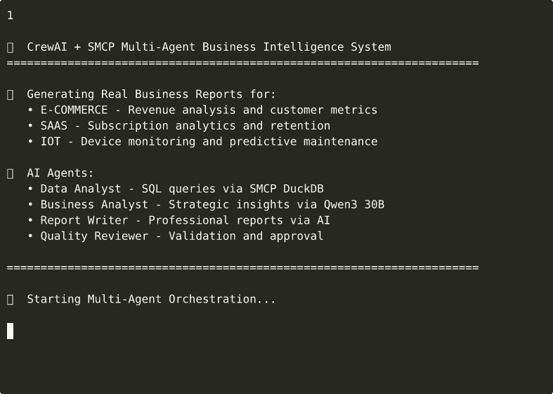

<p align="center">
  
</p>

# SMCP — Secure Model Context Protocol

> **[MCP](https://modelcontextprotocol.io/) with authentication, per-message encryption, and
> multi-agent (A2A) coordination — so MCP tools run safely over a network and between agents.**

[](https://www.python.org/downloads/)
[](https://opensource.org/licenses/MIT)
[](https://modelcontextprotocol.io/)

## 🎬 Demo: Multi-Agent Business Intelligence in Action



*CrewAI + SMCP orchestrating multiple AI agents to generate business-intelligence reports over
e-commerce, SaaS, and IoT data using local Ollama models, DuckDB, and secure multi-agent
coordination.*

## 🚀 What SMCP is

[MCP](https://modelcontextprotocol.io/) is a great way to give an AI model tools, but it's built for
a **local, trusted transport** (stdio on a single machine). **SMCP keeps MCP's tool model exactly
as-is and wraps it in a security + coordination layer**, so the same tools work *across machines* and
*between agents*:

- 🔒 **Authentication** — `api_key` → JWT sessions, with an optional asymmetric (RS256) mode so a
  server signs tokens that clients can verify but cannot forge
- 🔐 **Encryption** — authenticated per-message payload encryption; ECDH key exchange for
  forward-secret session keys
- 🛡️ **Fail-closed by design** — the server/client refuse to start with empty, weak, or
  publicly-known secrets; plaintext transport is refused to non-loopback hosts
- 🔁 **Replay protection** — signed messages carry a freshness window and are accepted only once
- 🤝 **Multi-agent (A2A)** — agent-to-agent discovery and orchestration, sequential or parallel
- 🔌 **Connectors** — hardened DuckDB and filesystem integrations to build tools against
- ✅ **MCP-compatible** — the security layer is opt-in; standard MCP tools keep working

Pick the posture that fits — from a simple API key for local testing up to per-message encryption
with an audit trail (see [Security modes](#-security-modes) below).

> **Status:** SMCP's *core* — auth (API-key / JWT / RS256), per-message encryption,
> replay protection, per-tool authorization, TLS enforcement, fail-closed config, the connectors,
> and external-IdP OAuth2 — is security-hardened and covered by an automated test suite (`pixi run
> test`, 118 tests). The DuckDB connector fails closed at the engine level (host filesystem/network
> access is off unless opted in, and raw SQL is screened for file/network/extension access); the
> filesystem connector enforces its extension allowlist symmetrically on read/delete/list; and
> `SMCPConfig.load()` preserves every setting (TLS, JWT algorithm, and the full OAuth2/crypto/cluster
> blocks) rather than silently dropping them. The distributed / agent-to-agent layer talks between
> nodes over the authenticated SMCP WebSocket RPC (a 2-node socket round-trip is exercised by the
> test suite). Federated auth supports an RS256 issuer — one node mints tokens with a private key,
> peers verify with the public key and cannot forge — with audience/issuer-bound tokens and
> target-bound forwarding proofs.
>
> Still deferred: pluggable discovery (Consul/etcd/DNS — static config-driven discovery only),
> forward-secret ECDH session keys (shared-secret HKDF today), and per-node asymmetric forwarding
> proofs. The integrations (CrewAI, MindsDB) and the OAuth2 flow are exercised against local/mock
> services, not a production identity provider; there has been no external security audit and it
> isn't yet running in production. The same core is used in the
> [RIXI](https://github.com/KellerKev/rixi) agent (`agent/smcp.py`) to share tools securely between
> agents over an untrusted link.

## 📚 Documentation

### Architecture & Design
- [**Architecture Overview**](docs/ARCHITECTURE_OVERVIEW.md) - Complete system architecture, data flows, and design patterns
- [**Demo Architectures**](docs/DEMO_ARCHITECTURES.md) - Detailed walkthroughs of each demo with step-by-step flows
- [**MCP vs SMCP Comparison**](docs/MCP_SMCP_COMPARISON.md) - Comprehensive comparison between standard MCP and SMCP
- [**Use Cases**](docs/USE_CASES.md) - Real-world applications and implementation scenarios

### Technical Guides
- [**AI SQL Generation Guide**](docs/AI_SQL_GENERATION_GUIDE.md) - Using LLMs for SQL query generation
- [**Connector Development Guide**](docs/CONNECTOR_DEVELOPMENT_GUIDE.md) - Building custom connectors
- [**CrewAI Integration**](docs/CREWAI_SMCP_INTEGRATION.md) - Integrating CrewAI with SMCP

## ✨ Key Features

### 🔐 Security modes

Choose per deployment — the same tools, a stronger posture as you need it:

- **Simple** — API key authentication → JWT sessions (local/dev)
- **Basic** — JWT sessions; rely on TLS (`wss://`) for transport security
- **Encrypted** — ECDH key exchange + authenticated per-message payload encryption
- **Enterprise** — OAuth2 client-credentials against an external identity provider (JWKS or a
  pinned static public key), with full token verification

Regardless of mode, the security layer is **fail-closed**: `SMCPConfig.validate()` rejects empty,
too-short, placeholder, or publicly-known secrets, and both `SMCPServer` and `SMCPClient` refuse to
start if validation fails.

### 🔑 Asymmetric tokens (RS256)

By default JWTs are signed with a shared secret (HS256) — fine within a single trust domain. For
multi-party deployments, set `jwt_algorithm="RS256"` with a server-held private key and a client
public key: the server mints tokens, clients verify them, and a client **cannot forge its own**.

**Federations should use RS256.** With a shared HS256 secret, any node that holds it can mint a token
for any identity. Under RS256, one **issuer** node holds the private key and mints client tokens
(`smcp_federated_auth.mint_client_jwt`); every other node holds only the public key and *verifies* —
a compromised verifier cannot forge identities. Generate a keypair with:

```bash
pixi run python tools/generate_jwt_keys.py generate -o ./jwt_keys
```

```toml
[security]
jwt_algorithm = "RS256"
jwt_private_key_path = "./jwt_keys/jwt_private.pem"   # issuer only
jwt_public_key_path  = "./jwt_keys/jwt_public.pem"    # every node
```

Tokens are bound to the federation issuer/audience, forwarding proofs are bound to their target node,
and cross-node calls run over the authenticated SMCP WebSocket RPC.

### 🏢 External-IdP OAuth2 (enterprise mode)

Enterprise mode validates OAuth2 access tokens from an external identity provider. It **fails
closed**: `oauth2.audience`, `oauth2.issuer`, and a key source (`oauth2.jwks_url` **or**
`oauth2.local_public_key_path`) are required, tokens are verified with the algorithm pinned to
RS256 and `exp`/`iat`/`aud`/`iss` required, IdP calls are forced to HTTPS with certificate
verification (a CA bundle can be pinned via `oauth2.ca_cert_path`), and JWKS key rotation is handled
automatically. Covered by an end-to-end test suite that runs against a mock OIDC provider (token
endpoint + JWKS), including wrong-audience, wrong-issuer, expired, `alg=none`, HS/RS-confusion, and
key-rotation cases.

### 🤖 Agent-to-Agent (A2A) System

- Multi-agent task orchestration
- Dynamic agent discovery
- Parallel and sequential workflows
- Per-tool authorization (a token scope authorizes a specific tool, not everything)

### 🔌 Native Connectors

- **DuckDB**: high-performance analytical queries. Filesystem/network access is **off by default**,
  enforced at the DuckDB engine level (`enable_external_access`); raw SQL is screened for
  file/network/extension access, identifiers are validated, and sanctioned file loads are confined to
  a configured directory. Opt into raw file SQL explicitly with `allow_raw_file_sql`.
- **Filesystem**: secure local storage with symlink-safe path containment, an extension allowlist
  enforced on read/delete/list (not just write), and read/write size caps.
- **Extensible**: easy to add custom connectors.

### 🏗️ Technical Features

- Configuration via TOML/YAML/ENV with a strict priority order
- Logging and monitoring examples
- Connection cap, per-client rate limiting, and message-size limits enforced by the server

## 📦 Installation

### Prerequisites

- Python 3.11+
- [Pixi](https://pixi.sh) package manager
- [Ollama](https://ollama.ai) (for the AI features in the demos)
- Docker (only for the MindsDB integration examples)

### Quick Start

1. **Clone the repository**:
```bash
git clone https://github.com/KellerKev/smcp.git
cd smcp
```

2. **Install dependencies with pixi**:
```bash
# Install pixi if you don't have it
curl -fsSL https://pixi.sh/install.sh | bash

# Core environment (fast)
pixi install

# Optional: heavy integrations (CrewAI + MindsDB SDK)
pixi install -e integrations
```

3. **Set up Ollama and pull a small model for the demos**:
```bash
# Install Ollama, then:
ollama serve &

# The examples default to a small, fast model:
ollama pull llama3.2:1b
```
The example/test model is configurable — set `SMCP_DEMO_MODEL` to use a different one:
```bash
export SMCP_DEMO_MODEL="qwen2.5-coder:7b-instruct-q4_K_M"
```

4. **(Optional) MindsDB for the MCP-bridge / ML examples**:
```bash
docker run -d --name smcp-mindsdb -p 47334:47334 -p 47337:47337 mindsdb/mindsdb
# Wait until healthy, then verify:
curl http://localhost:47334/api/status
```

📚 **Full Setup Guide**: See [SETUP_GUIDE.md](SETUP_GUIDE.md) for detailed instructions.

## 🧪 Testing

```bash
# Full pytest suite (security, connectors, and end-to-end server/client)
pixi run test

# Just the crypto interop vector
pixi run test-interop
```

The suite covers config validation, the removal of the old demo backdoor, replay/staleness
rejection, per-tool authorization, JWT issuer/audience/expiry, the RS256 verify-only client, TLS
enforcement, DuckDB injection/path-confinement, and filesystem traversal/size caps. The
external-IdP OAuth2 flow is exercised end-to-end against a mock OIDC provider. The
server/client end-to-end test stands up a real server and client on loopback (the Ollama-backed
test skips automatically if Ollama or the demo model isn't available).

## 🎯 Quick Demo

The example scripts generate strong, per-machine demo secrets automatically (cached in a
git-ignored `examples/.demo_secrets.json`) so a server and client interoperate under the hardened
validation without any secrets in the repo.

### 1. Server + client end to end

```bash
# Terminal 1
pixi run example-server

# Terminal 2
pixi run example-client
```
Exercises handshake → auth → capability discovery → tool invocation, plus a live Ollama call.

### 2. DuckDB analytics

```bash
pixi run python tools/generate_sample_data.py   # writes sample_data/
pixi run duckdb-example
```
Loads tens of thousands of rows, has the model generate SQL from a business question, executes it
via the SMCP DuckDB connector, and analyzes the results.

### 3. Complete system showcase

```bash
pixi run python examples/showcase_complete_system.py
```

### 4. Multi-agent report generation (CrewAI)

```bash
pixi run -e integrations crewai-report-demo
```
Runs Data Analyst → Business Analyst → Report Writer → Quality Reviewer agents against local Ollama
and writes an executive report to `./crewai_reports/`.

### 5. MindsDB integration (requires the MindsDB container above)

```bash
pixi run python examples/basic/basic_a2a_mcp_sample.py
pixi run python examples/mindsdb_integration_example.py
```

## 🏃 Running a server, and connecting a client

### Server

```bash
# Generate a config with fresh strong secrets, then start:
pixi run create-config
pixi run server
```

### Client (library)

```python
import secrets
from smcp_client import SMCPClient
from smcp_config import SMCPConfig

# Secrets are required and must match the server's (shared-secret modes).
# The server refuses to start, and the client refuses to connect, with weak/empty values.
config = SMCPConfig(
    mode="basic",
    server_url="ws://localhost:8765",
    api_key=secrets.token_urlsafe(32),
    secret_key=secrets.token_urlsafe(32),
    jwt_secret=secrets.token_urlsafe(32),
    kdf_salt=secrets.token_urlsafe(16),
)
config.security.allow_insecure_transit = True  # loopback only; use wss:// in production

client = SMCPClient(config)
await client.connect()

capabilities = client.list_capabilities()
result = await client.invoke_tool("calculator", operation="add", a=15, b=27)

await client.disconnect()
```

## 📁 Project Structure

```
smcp/
├── smcp_*.py                 # Core SMCP modules
├── connectors/               # Native connector implementations
│   ├── smcp_duckdb_connector.py
│   └── smcp_filesystem_connector.py
├── examples/                 # Demo applications
│   ├── _demo_support.py      # Shared strong-secret helper for the demos
│   ├── basic/                # Basic (JWT) mode examples
│   ├── encrypted/            # Encrypted mode examples
│   └── *.py                  # Integration examples
├── tests/                    # Pytest suite (security, connectors, e2e)
├── tools/                    # Utility scripts (sample data, key generation)
├── docs/                     # Documentation
└── pixi.toml                 # Environments and tasks
```

## 🔧 Configuration

SMCP merges configuration from (highest priority first): CLI args → environment → config file →
defaults. Secrets are required; the app fails closed if they're missing or weak.

### Environment variables
```bash
export SCP_API_KEY="$(python -c 'import secrets;print(secrets.token_urlsafe(32))')"
export SCP_SECRET_KEY="$(python -c 'import secrets;print(secrets.token_urlsafe(32))')"
export SCP_JWT_SECRET="$(python -c 'import secrets;print(secrets.token_urlsafe(32))')"
export SCP_KDF_SALT="$(python -c 'import secrets;print(secrets.token_urlsafe(16))')"
export SCP_MODE="basic"
```
See [.env.example](.env.example) for the full list. Share `SCP_SECRET_KEY` / `SCP_JWT_SECRET` /
`SCP_KDF_SALT` across nodes in a federation.

### TOML
```bash
pixi run create-config   # writes scp_config.toml with fresh strong secrets
```

## 🛡️ Security notes

1. **Secrets** — 32+ char random `secret_key`/`jwt_secret`, 16+ char `kdf_salt`; never commit them.
   `validate()` rejects empty/short/placeholder/known values.
2. **Transport** — set `security.tls_enabled=True` (with cert/key) and use `wss://`/`https://` in
   production. Plaintext is only permitted to loopback, and only when
   `security.allow_insecure_transit` is set.
3. **Tokens** — use `jwt_algorithm="RS256"` (server private key, client public key) when clients
   should not be able to mint their own tokens.
4. **Connectors** — keep DuckDB `enable_external_access=False` unless you need host file/network
   access, and set a `data_dir` to confine file operations.

## 🤝 MCP Compatibility

SMCP keeps MCP's tool model intact; the security layer is additive. Standard MCP tools continue to
work, and the [MCP bridge](smcp_mcp_bridge.py) connects SMCP to external MCP servers (refusing to
send credentials over plaintext unless the target is loopback).

## 🤲 Contributing

Contributions are welcome. Please run `pixi run test` before opening a pull request.

## 📄 License

This project is licensed under the MIT License.

## 🙏 Acknowledgments

- Built on top of the [Model Context Protocol](https://github.com/modelcontextprotocol)
- Uses [Ollama](https://ollama.ai) for local AI models
- Integrates with [CrewAI](https://github.com/joaomdmoura/crewAI) for orchestration
- Database features powered by [DuckDB](https://duckdb.org)

## 🚦 Status

- ✅ **Core SMCP**: security-hardened and test-covered (118 tests)
- ✅ **Basic/Encrypted modes**: security-hardened, test-covered
- ✅ **A2A / distributed system**: real multi-node networking over the authenticated SMCP
  WebSocket RPC (handshake → auth → tool-invoke), with a 2-node socket test. Consul/etcd/DNS
  discovery is not implemented (static config-driven discovery only); forward-secret ECDH session
  keys are still deferred (shared-secret HKDF today)
- ✅ **DuckDB / Filesystem connectors**: hardened, fail-closed by default, test-covered
- ✅ **CrewAI Integration**: working demo (in the `integrations` env)
- ✅ **MindsDB integration**: working demo (requires a MindsDB container)
- ✅ **Enterprise / OAuth2 mode**: external-IdP token validation, hardened and test-covered
  (JWKS + static-key), verified against a mock OIDC provider
- ✅ **Federated auth**: RS256 issuer/verify (an issuer mints with a private key, peers verify with
  the public key and cannot forge), audience/issuer-bound tokens, target-bound forwarding proofs,
  test-covered. HS256 shared-secret remains available for a single trust domain. Per-node
  asymmetric forwarding proofs are the remaining deferred item

---

**Want to explore MCP security concepts?** Start with the [Quick Demo](#-quick-demo) above.
